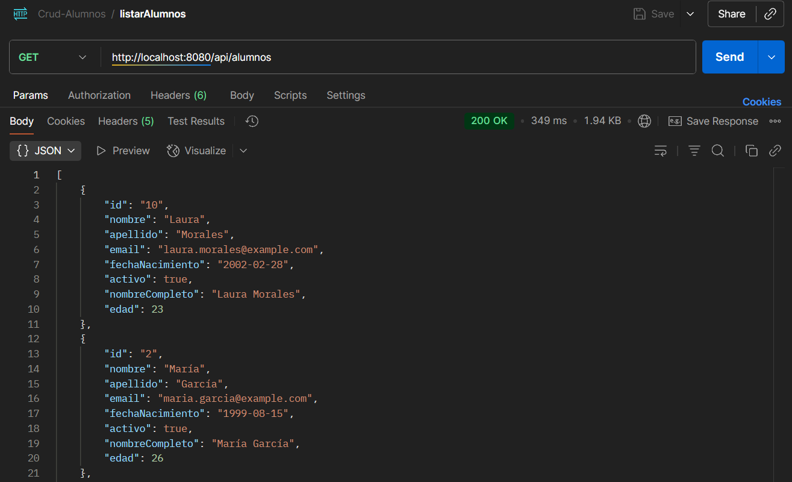
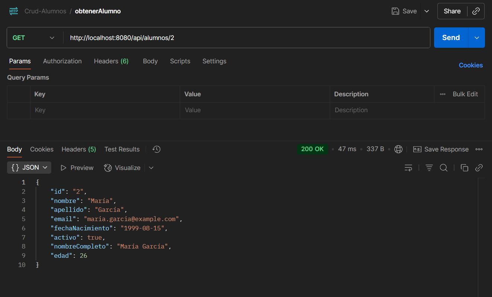
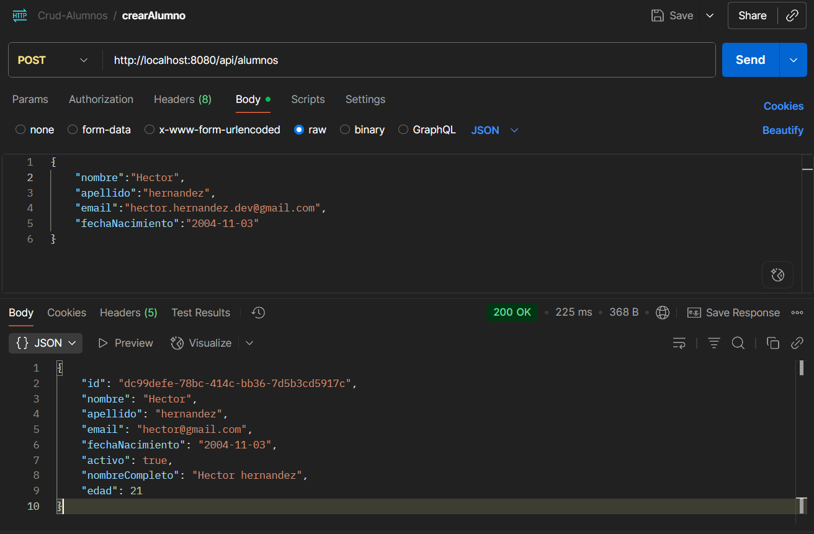
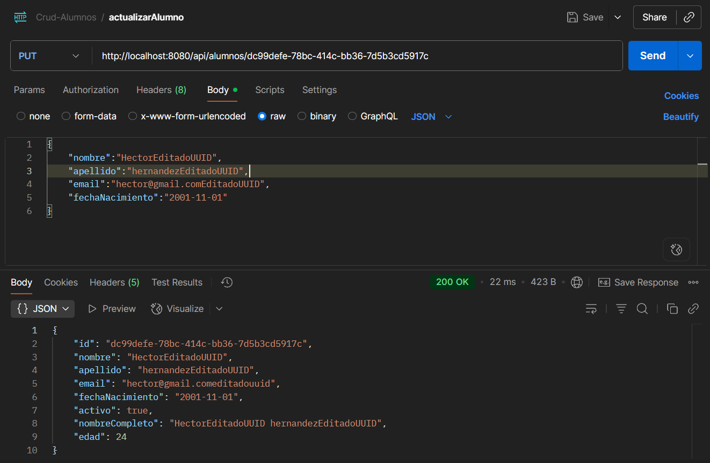
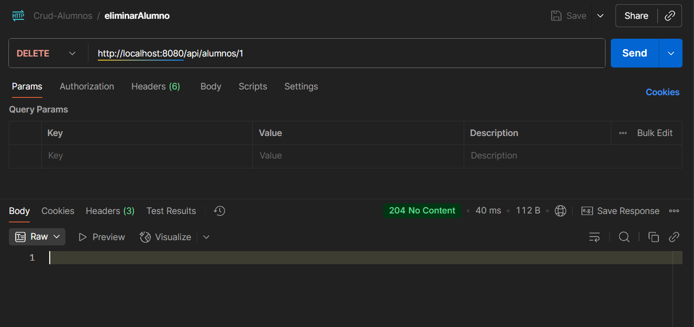
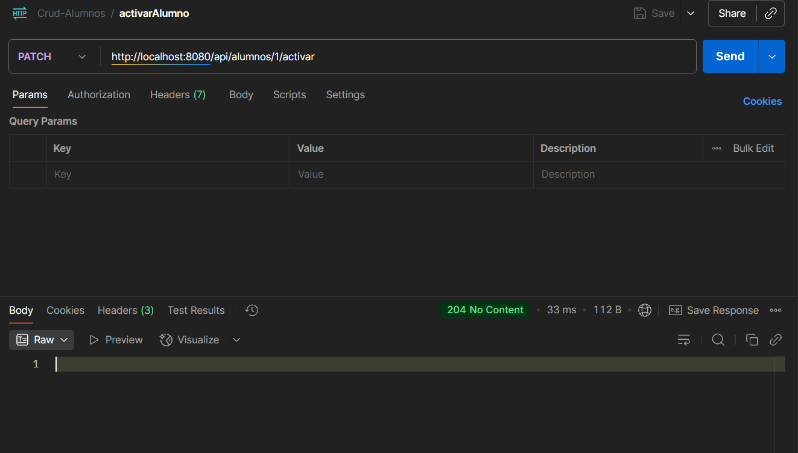
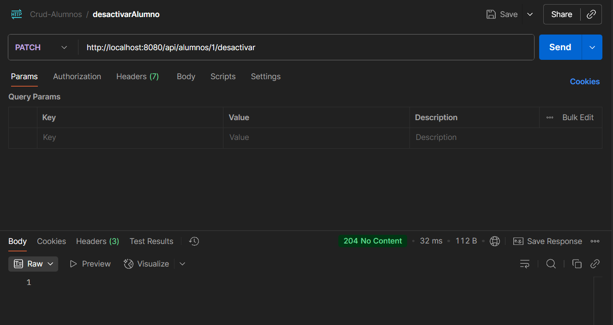

# 🚀 API de gestion de Alumnos (ARQUITECTURA HEXAGONAL)

Este proyecto expone un conjunto de endpoints REST.

## 📸 Ejemplos de pruebas en Postman

### 🔹 Endpoint: Listar Alumnos

### 🔹 Endpoint: Obtener Alumno Por ID

### 🔹 Endpoint: Crear Alumno

### 🔹 Endpoint: Actualizar Alumno

### 🔹 Endpoint: Eliminar Alumno

### 🔹 Endpoint: Activar a un Alumno

### 🔹 Endpoint: Desactivar a un Alumno

## 📂 Colección Postman

Puedes importar la colección de Postman para probar los endpoints:  
[Descargar colección aquí](postman/Crud-Alumnos.postman_collection.json)
